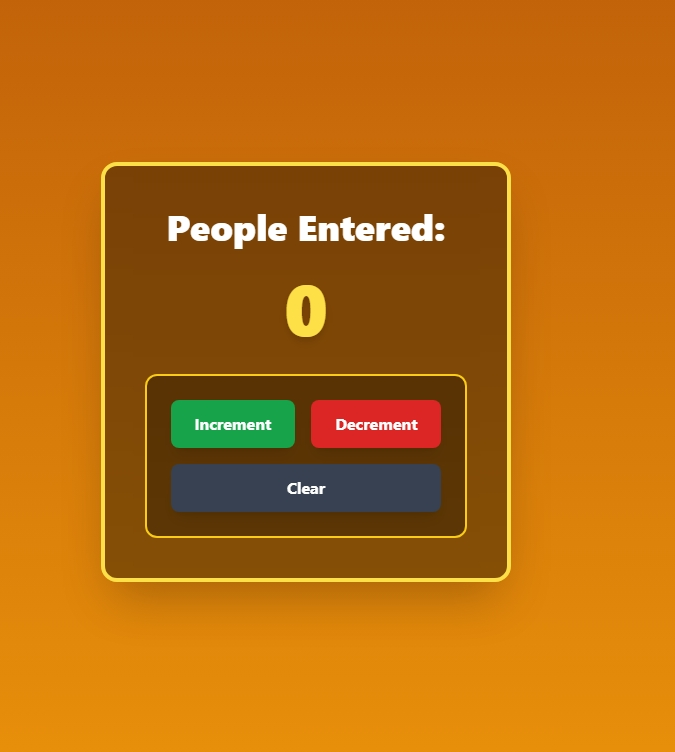

People Counter
A simple interactive People Counter built with HTML, Tailwind CSS, and JavaScript. This project lets users increment, decrement, and clear a displayed number. It was created as a beginner JavaScript project to practice DOM manipulation, function calls, and UI styling.

🚀 Features
Increment, decrement, and clear buttons

Prevents negative numbers

Game‑style UI with Tailwind CSS

Large, glowing counter display

Clean, centered layout

Responsive design

🛠️ Tech Used
HTML

Tailwind CSS

JavaScript (DOM manipulation)

📚 What I Learned
How to update the DOM using document.getElementById()

How to write and connect JavaScript functions to buttons

How to prevent invalid values with simple logic

How to style components using Tailwind utility classes

How to structure a clean, responsive UI

📦 How to Run
Click on live link --> https://makcoder671.github.io/People-Counter/

Click the buttons to update the counter

🔮 Future Improvements
Add sound effects for button clicks

Add a save history feature

Add animations or a scoreboard theme

Add keyboard controls